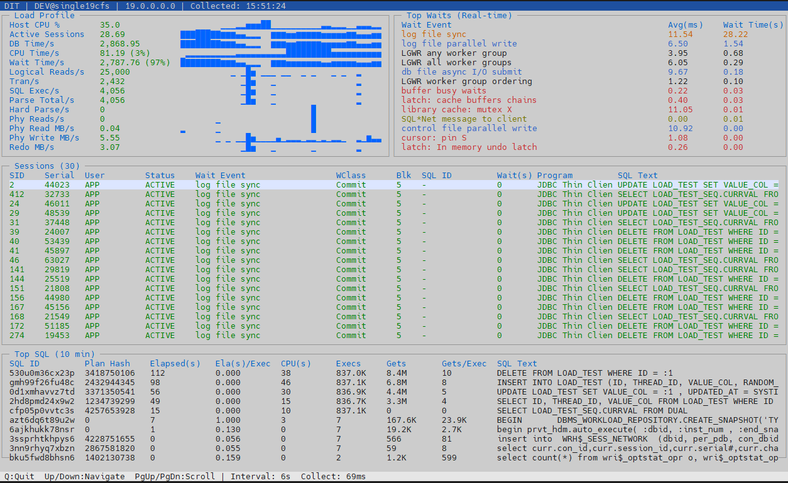

# DIT (DBmon-In-Terminal)

SSH 터미널 환경에서 Oracle / Tibero DB를 실시간 모니터링하는 Java 기반 TUI 도구. 단일 fat JAR (Java 8+)로 배포.

## 지원 DBMS

| DBMS | 상태 | 비고 |
|------|------|------|
| Oracle | ✅ | 19c 이상 검증 |
| Tibero | ✅ | Tibero 6/7 검증 |

## 빠른 시작

> **💡 Windows 환경 실행 주의사항**
> Windows에서 TUI 모드(`--command tui`)를 실행할 때는 터미널 I/O 충돌을 방지하기 위해 `java` 대신 **`javaw`** 명령어를 사용해야 합니다.
> 예시: `javaw -jar java/dit-bridge/target/dit-dbms-monitor-0.1.2.jar ...`

```bash
# 빌드
mvn clean package -f java/dit-bridge/pom.xml

# Oracle TUI (Windows는 javaw 사용)
java -jar java/dit-bridge/target/dit-dbms-monitor-0.1.2.jar \
  --dbms-type oracle --command tui \
  --host <db-host> --port 1521 \
  --service-name <service> \
  --user <monitoring user> --password <user password>

# Tibero TUI (Windows는 javaw 사용)
java -jar java/dit-bridge/target/dit-dbms-monitor-0.1.2.jar \
  --dbms-type tibero --command tui \
  --host <db-host> --port 8629 \
  --service-name <dbname> \
  --user <monitoring user> --password <user password>
```

## 모니터링 유저 생성

DBA 권한이 아닌 최소 권한으로 모니터링 전용 유저를 생성합니다.

### Oracle

```sql
-- system 유저로 실행
CREATE USER <monitoring user> IDENTIFIED BY <user password> DEFAULT TABLESPACE users TEMPORARY TABLESPACE temp;
ALTER USER <monitoring user> QUOTA 0 ON users;

GRANT CREATE SESSION TO <monitoring user>;
GRANT SELECT ANY DICTIONARY TO <monitoring user>;  -- V$ 뷰 조회
GRANT ALTER SYSTEM TO <monitoring user>;           -- kill session 용 (선택)
```

### Tibero

```sql
-- sys 유저로 실행
CREATE USER <monitoring user> IDENTIFIED BY <user password> DEFAULT TABLESPACE USR TEMPORARY TABLESPACE TEMP;

GRANT CREATE SESSION TO <monitoring user>;
GRANT SELECT ANY DICTIONARY TO <monitoring user>;      -- V$ 뷰 조회
GRANT EXECUTE ON DBMS_APPLICATION_INFO TO <monitoring user>;  -- 세션 식별
GRANT ALTER SYSTEM TO <monitoring user>;                -- kill session 용 (선택)
```

### 필요 V$ 뷰

| V$ 뷰 | Oracle | Tibero | 용도 |
|--------|--------|--------|------|
| V$SYSMETRIC | O | - | AAS, DB Time, CPU, Wait Time, Host CPU % |
| V$SYSSTAT | O | O | Load Profile 델타 (Exec, Reads, Writes 등) |
| V$SYS_TIME_MODEL | - | O | DB Time, DB CPU |
| V$OSSTAT2 | - | O | Host CPU 사용률 (Tibero 6 FS06+) |
| V$SESSION | O | O | 활성 세션 |
| V$SQL | O | O | Top SQL |
| V$SYSTEM_EVENT | O | O | Wait Event |
| V$INSTANCE | O | O | 인스턴스 정보 |
| V$EVENT_NAME | - | O | Wait Event 이름/클래스 |
| V$MYSTAT | - | O | 자기 SID 식별 |

## 모니터링 화면 (TUI)

Lanterna Screen 기반 대시보드. Load Profile 스파크라인, 실시간 Wait 델타, 활성 세션, Top SQL:



## 키 바인딩

| 키 | 동작 |
|----|------|
| `Q` / `Esc` | 종료 |
| `Up` / `Down` | 세션 선택 |
| `PgUp` / `PgDn` | 세션 스크롤 (10행) |
| `Home` / `End` | 첫/마지막 세션 이동 |
| `Tab` | SQL 패널 스크롤 |
| `R` | 강제 새로고침 |

## CLI 명령어

```bash
# 공통 인자: --dbms-type oracle|tibero --host --port --service-name --user --password

# 접속 확인
java -jar dit-dbms-monitor-0.1.2.jar --dbms-type oracle --command health ...

# 메트릭 스냅샷 (JSON)
java -jar dit-dbms-monitor-0.1.2.jar --dbms-type oracle --command metrics ...

# 활성 세션 목록 (JSON)
java -jar dit-dbms-monitor-0.1.2.jar --dbms-type oracle --command sessions ...

# 대기 이벤트 (JSON)
java -jar dit-dbms-monitor-0.1.2.jar --dbms-type oracle --command waits ...

# SQL 핫스팟 (JSON)
java -jar dit-dbms-monitor-0.1.2.jar --dbms-type oracle --command sql ...

# 연속 모니터링 + JSONL 녹화
java -jar dit-dbms-monitor-0.1.2.jar --dbms-type oracle --command monitor \
  --interval-seconds 5 --record-file run.jsonl --capture-file screen.txt ...

# TUI 대시보드 (Windows는 javaw 사용)
java -jar dit-dbms-monitor-0.1.2.jar --dbms-type oracle --command tui --interval 6 ...

# 세션 강제 종료
java -jar dit-dbms-monitor-0.1.2.jar --dbms-type oracle --command kill --sid <sid,serial#> ...

# 녹화 파일 리포트 (Markdown)
java -jar dit-dbms-monitor-0.1.2.jar --command report --record-file run.jsonl --output report.md
```

## 아키텍처

```
java/dit-bridge/src/main/java/io/dit/bridge/
  DitMain.java                -- 진입점, CLI 라우팅, JSON 직렬화
  DbmsType.java               -- DBMS 타입 enum (ORACLE, TIBERO, ...)

  api/
    DbmsCollector.java         -- DBMS별 수집기 인터페이스
    DbmsConnectionFactory.java -- DBMS별 접속 팩토리 인터페이스
    WaitDeltaTracker.java      -- Wait Event 델타 추적 인터페이스

  core/
    MetricsBuffer.java         -- Ring Buffer (capacity=60) + Unicode Sparkline
    JsonUtil.java              -- 경량 JSON 직렬화 (외부 라이브러리 없음)

  oracle/
    OracleCollector.java       -- Oracle V$ 뷰 JDBC 쿼리 (V$SYSMETRIC + V$SYSSTAT 델타)
    OracleConnectionFactory.java -- Oracle JDBC 접속
    OracleWaitDeltaTracker.java  -- V$SYSTEM_EVENT 델타 연산
    OracleMonitorTui.java      -- Lanterna TUI 대시보드

  tibero/
    TiberoCollector.java       -- Tibero V$ 뷰 쿼리 + V$SYSSTAT/V$OSSTAT 델타
    TiberoConnectionFactory.java -- Tibero JDBC 접속
    TiberoWaitDeltaTracker.java  -- V$SYSTEM_EVENT 델타 연산
    TiberoMonitorTui.java      -- Lanterna TUI 대시보드
```

## 빌드

```bash
mvn clean package -f java/dit-bridge/pom.xml
```

출력: `java/dit-bridge/target/dit-dbms-monitor-0.1.2.jar` (fat JAR, Oracle JDBC + Tibero JDBC + Lanterna 포함)

## 기술 스택

| 항목 | 기술 | 버전 |
|------|------|------|
| 언어 | Java | 8+ |
| 빌드 | Maven + maven-shade-plugin | 3.x |
| TUI | Lanterna (Screen layer) | 3.1.3 |
| Oracle 드라이버 | ojdbc8 | 23.3.0.23.09 |
| Tibero 드라이버 | tibero7-jdbc | 7.0 |
| 패키지 | `io.dit.bridge` | 0.1.2 |

## 변경 이력

### v0.1.2

- **Load Profile V$SYSSTAT 델타 전환 (Oracle)**: DB Time/CPU/Wait/AAS만 V$SYSMETRIC에서 조회하고, 나머지 메트릭(Exec, Logical Reads, Phy Reads/Writes, Redo, Parse, Tran 등)은 V$SYSSTAT 델타 기반으로 전환
- **Host CPU % 추가**: Load Profile 최상단에 Host CPU 사용률 표시 (Oracle: V$SYSMETRIC `Host CPU Utilization (%)`, Tibero: V$OSSTAT2 `BUSY_TIME`/`IDLE_TIME` 델타)
- **TUI 배경색 변경**: `ANSI.WHITE` → `ANSI.WHITE_BRIGHT`로 변경하여 더 밝은 배경 적용
- **Top Waits 13개**: Wait Event 표시 개수를 12개에서 13개로 증가
- **Top SQL K/M 단위**: Elapsed(s), CPU(s), Execs, Gets, Gets/Exec 값에 K/M/G 축약 단위 적용
- **Top SQL Ela(s)/Exec 컬럼 추가**: SQL당 평균 실행 시간 컬럼 추가
- **JAR 파일명 버전 포함**: 빌드 출력 파일명이 `dit-dbms-monitor-0.1.2.jar` 형태로 변경
- **Tibero V$OSSTAT → V$OSSTAT2**: Tibero에는 V$OSSTAT이 없어 V$OSSTAT2로 수정 (Tibero 6 FS06+)
- **Tibero Sessions READY 제외**: STATUS='READY' 세션을 활성 세션 목록에서 필터링
- **TUI 레이아웃 조정**: Sessions 패널 5줄 축소, Top SQL 패널 4줄 확대
- **Top SQL 하단 border 잘림 수정**: maxSqlVisible 계산에서 bottom border를 미차감하여 마지막 데이터 행이 border를 덮어쓰는 버그 수정

### v0.1.1

- Windows `javaw` TUI 실행 지원 문서화
- Light 테마 적용 (밝은 배경)
- Gets/Exec 메트릭 추가
- Top SQL 단위를 ms → s로 변경
