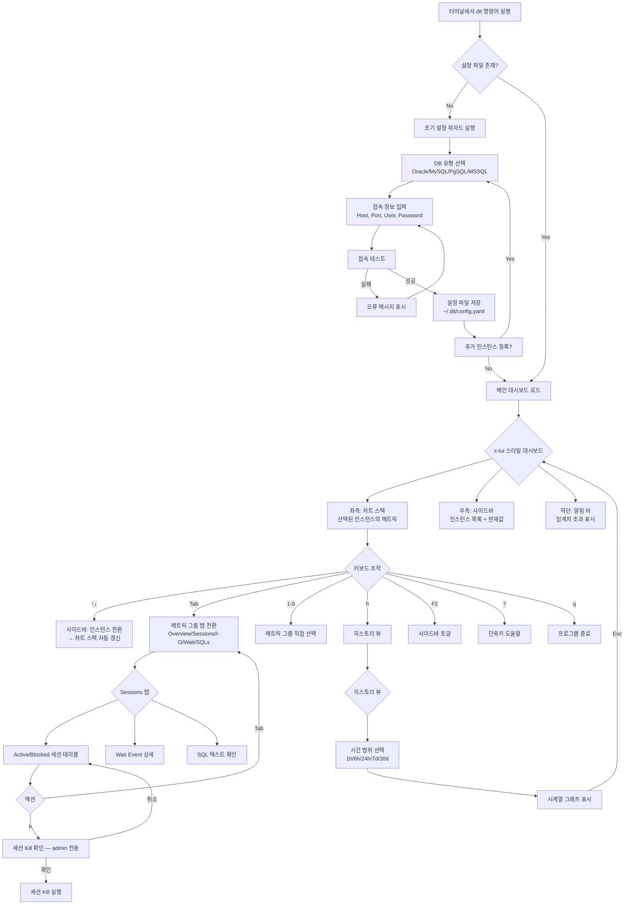
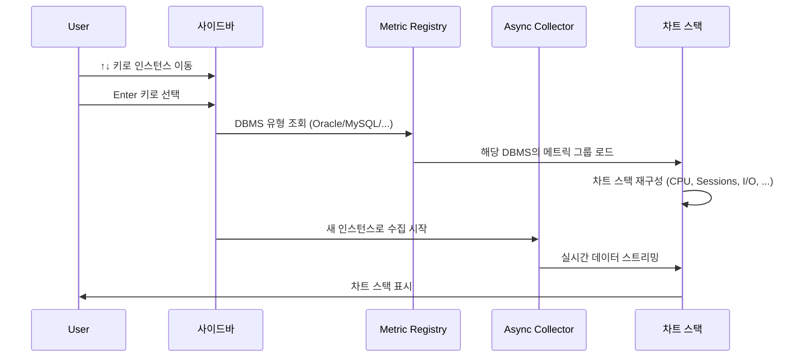
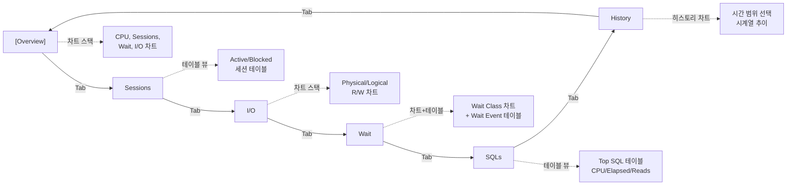
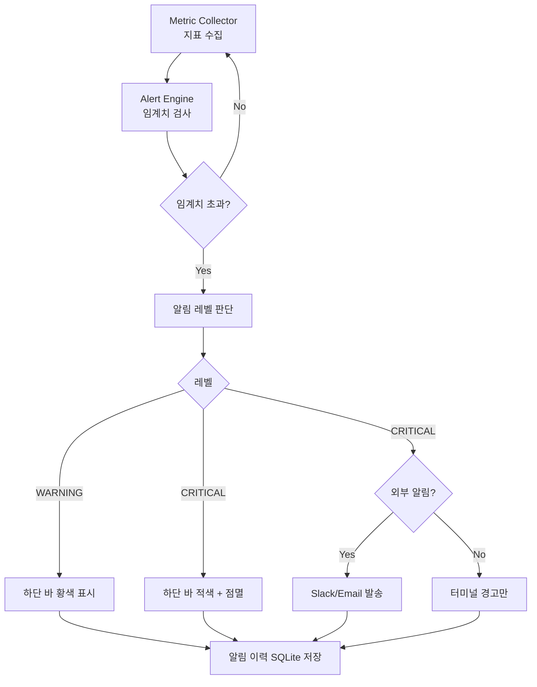
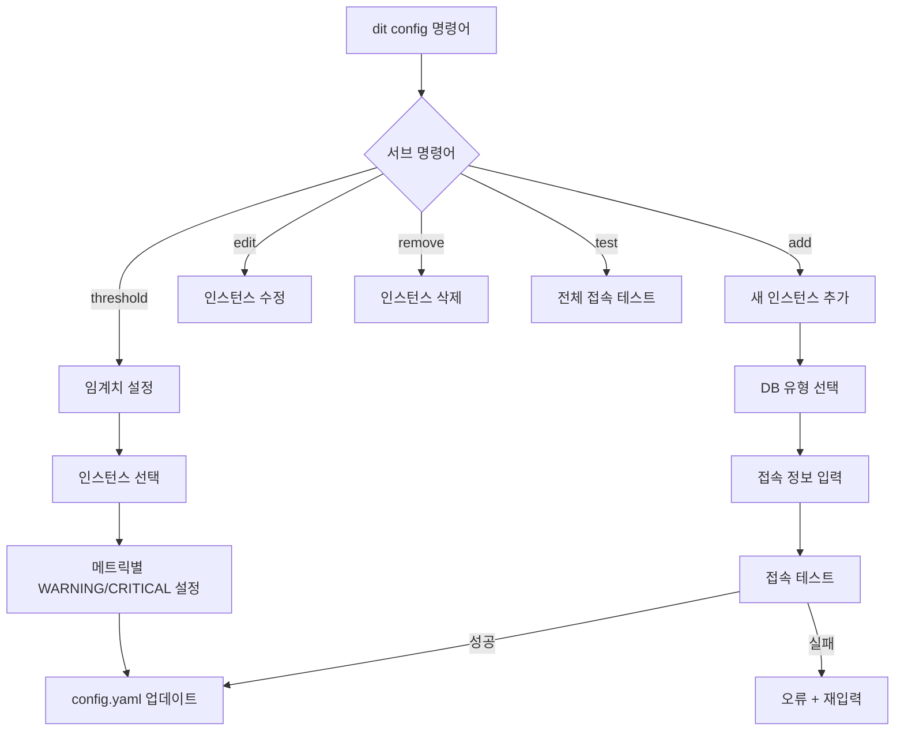

# DOC-3: User Flow (사용자 흐름도)

## 3.1 전체 사용자 흐름

```mermaid
graph TD
    A[터미널에서 dit 명령어 실행] --> B{설정 파일 존재?}
    B -->|No| C[초기 설정 위자드 실행]
    C --> D[DB 유형 선택<br/>Oracle/MySQL/PgSQL/MSSQL]
    D --> E[접속 정보 입력<br/>Host, Port, User, Password]
    E --> F[접속 테스트]
    F -->|실패| G[오류 메시지 표시]
    G --> E
    F -->|성공| H[설정 파일 저장<br/>~/.dit/config.yaml]
    H --> I[추가 인스턴스 등록?]
    I -->|Yes| D
    I -->|No| J[메인 대시보드 로드]
    
    B -->|Yes| J
    
    J --> K{s-tui 스타일 대시보드}
    K --> L[좌측: 차트 스택<br/>선택된 인스턴스의 메트릭]
    K --> M[우측: 사이드바<br/>인스턴스 목록 + 현재값]
    K --> N[하단: 알림 바<br/>임계치 초과 표시]
    
    L --> O{키보드 조작}
    O -->|↑↓| P[사이드바: 인스턴스 전환<br/>→ 차트 스택 자동 갱신]
    O -->|Tab| Q[메트릭 그룹 탭 전환<br/>Overview/Sessions/I-O/Wait/SQLs]
    O -->|1-9| R[메트릭 그룹 직접 선택]
    O -->|h| S[히스토리 뷰]
    O -->|F2| T[사이드바 토글]
    O -->|?| U[단축키 도움말]
    O -->|q| V[프로그램 종료]
    
    Q --> W{Sessions 탭}
    W --> X[Active/Blocked 세션 테이블]
    W --> Y[Wait Event 상세]
    W --> Z[SQL 텍스트 확인]
    
    X --> AA{액션}
    AA -->|k| AB[세션 Kill 확인 — admin 전용]
    AB -->|확인| AC[세션 Kill 실행]
    AB -->|취소| X
    AA -->|Tab| Q
    
    S --> AD{히스토리 뷰}
    AD --> AE[시간 범위 선택<br/>1h/6h/24h/7d/30d]
    AE --> AF[시계열 그래프 표시]
    AF -->|Esc| K
```

## 3.2 인스턴스 전환 흐름

```mermaid
sequenceDiagram
    participant User
    participant Sidebar as 사이드바
    participant Registry as Metric Registry
    participant Collector as Async Collector
    participant Charts as 차트 스택

    User->>Sidebar: ↑↓ 키로 인스턴스 이동
    User->>Sidebar: Enter 키로 선택
    Sidebar->>Registry: DBMS 유형 조회 (Oracle/MySQL/...)
    Registry->>Charts: 해당 DBMS의 메트릭 그룹 로드
    Charts->>Charts: 차트 스택 재구성 (CPU, Sessions, I/O, ...)
    Sidebar->>Collector: 새 인스턴스로 수집 시작
    Collector->>Charts: 실시간 데이터 스트리밍
    Charts->>User: 차트 스택 표시
```

## 3.3 메트릭 그룹 탭 전환

```mermaid
graph LR
    A["[Overview]"] -->|Tab| B[Sessions]
    B -->|Tab| C[I/O]
    C -->|Tab| D[Wait]
    D -->|Tab| E[SQLs]
    E -->|Tab| F[History]
    F -->|Tab| A
    
    A -.->|"차트 스택"| G[CPU, Sessions,<br/>Wait, I/O 차트]
    B -.->|"테이블 뷰"| H[Active/Blocked<br/>세션 테이블]
    C -.->|"차트 스택"| I[Physical/Logical<br/>R/W 차트]
    D -.->|"차트+테이블"| J[Wait Class 차트<br/>+ Wait Event 테이블]
    E -.->|"테이블 뷰"| K[Top SQL 테이블<br/>CPU/Elapsed/Reads]
    F -.->|"히스토리 차트"| L[시간 범위 선택<br/>시계열 추이]
```

## 3.4 알림 흐름

```mermaid
graph TD
    A[Metric Collector<br/>지표 수집] --> B[Alert Engine<br/>임계치 검사]
    B --> C{임계치 초과?}
    C -->|No| A
    C -->|Yes| D[알림 레벨 판단]
    D --> E{레벨}
    E -->|WARNING| F[하단 바 황색 표시]
    E -->|CRITICAL| G[하단 바 적색 + 점멸]
    E -->|CRITICAL| H{외부 알림?}
    H -->|Yes| I[Slack/Email 발송]
    H -->|No| J[터미널 경고만]
    F --> K[알림 이력 SQLite 저장]
    G --> K
    I --> K
    J --> K
```

## 3.5 설정 관리

```mermaid
graph TD
    A[dit config 명령어] --> B{서브 명령어}
    B -->|add| C[새 인스턴스 추가]
    B -->|edit| D[인스턴스 수정]
    B -->|remove| E[인스턴스 삭제]
    B -->|test| F[전체 접속 테스트]
    B -->|threshold| G[임계치 설정]
    
    C --> H[DB 유형 선택]
    H --> I[접속 정보 입력]
    I --> J[접속 테스트]
    J -->|성공| K[config.yaml 업데이트]
    J -->|실패| L[오류 + 재입력]
    
    G --> M[인스턴스 선택]
    M --> N[메트릭별 WARNING/CRITICAL 설정]
    N --> K
```
