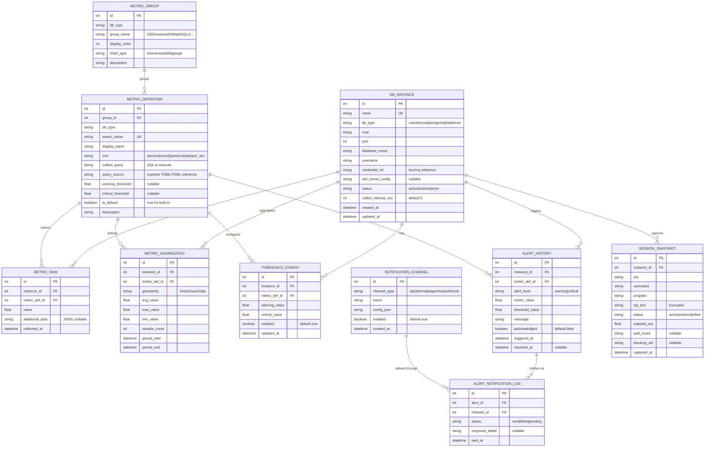

# DOC-4: Database Design (데이터베이스 설계)

## 4.1 ERD (Entity Relationship Diagram)



## 4.2 핵심 테이블 설명

**DB_INSTANCE:** 모니터링 대상 DB 인스턴스. `db_type` 필드에 따라 해당 DBMS의 METRIC_GROUP과 METRIC_DEFINITION이 자동 로드된다. 비밀번호는 OS 키링/환경변수 참조 키만 저장.

**METRIC_GROUP:** DBMS별 메트릭 그룹 정의. UI의 차트 스택 및 탭 구성과 1:1 매핑된다. `chart_type`으로 시계열 차트 스택/데이터 테이블/게이지 중 렌더링 방식 결정.

**METRIC_DEFINITION:** 개별 메트릭 정의. `collect_query`는 Exporter에서 가져온 실제 SQL. `query_source`에 원본 Exporter 파일 참조를 기록하여 추적 가능.

**METRIC_RAW / METRIC_AGGREGATED:** 원시 수집 데이터와 시간 기반 집계 데이터. 생명주기 정책에 따라 자동 롤업 및 퍼지.

**SESSION_SNAPSHOT:** 세션 상태 스냅샷. Sessions 탭의 데이터 소스. Active/Blocked 세션, Wait Event, SQL 텍스트 포함.

**ALERT_HISTORY + ALERT_NOTIFICATION_LOG:** 알림과 발송을 분리하여, 채널 장애 시에도 알림 이력 보존.

## 4.3 DBMS별 메트릭 그룹 (Grafana/Exporter 기반)

### Oracle (9 그룹)

| 그룹 | 차트 유형 | Exporter Source | 주요 메트릭 |
|------|-----------|----------------|------------|
| OS | timeseries | ora_cpustat, ora_memstat | Host CPU %, Oracle CPU %, OS Memory % |
| Time Model & Wait | timeseries | ora_sysstat, ora_system_event | DB Time, CPU Time, Wait Events |
| Logical I/O | timeseries | ora_sysstat | Logical Reads, Block Gets, Consistent Gets |
| Physical I/O | timeseries | ora_sysstat | Physical Reads/Writes (bytes, blocks) |
| Tablespace | gauge | Custom SQL | Data/Temp/Undo size & usage % |
| Hit Ratio | timeseries | ora_metric | Buffer/Library/Row Cache, Soft Parse % |
| Sessions | table | ora_wait_sess | Active, Blocked, Wait Event, SQL info |
| Top SQLs | table | ora_top_cpu_sqls | CPU Time, Elapsed, Disk Reads |
| RAC | timeseries | ora_sysstat (gc_*) | GC Wait, CR/Current Blocks |

### MySQL / MariaDB (9 그룹)

| 그룹 | 차트 유형 | Exporter Source | 주요 메트릭 |
|------|-----------|----------------|------------|
| SQL Activity | timeseries | mysql_sql_digest_summary | SQL Time, Executions, Slow queries |
| Connections | timeseries | mysql_global_status | Threads running, Current, Lock Wait |
| Handler | timeseries | mysql_global_status | read rows (scan/index), DML counts |
| InnoDB Activity | timeseries | mysql_innodb_metrics | Logical reads, Disk R/W, Fsyncs |
| Sort & Temp | timeseries | mysql_global_status | Sort merges, Tmp disk tables |
| InnoDB Buffer | timeseries | mysql_global_status | Buffer pool hit %, pages |
| Redo Log | timeseries | mysql_global_status | Log waits, writes, Checkpoint Age |
| Replication | timeseries | mysql_global_status | Slave IO/SQL, Lag |
| Top SQLs | table | mysql_digest_sql | Time, lock time, rows, errors |

### PostgreSQL (8 그룹)

| 그룹 | 차트 유형 | Exporter Source | 주요 메트릭 |
|------|-----------|----------------|------------|
| SQL Activity | timeseries | pg_stat_statements | SQL Time, Executions |
| Connections | timeseries | pg_stat_activity | Active, idle, max |
| Rows | timeseries | pg_stat_database | Fetched, inserted, updated, deleted |
| Data Blocks | timeseries | pg_stat_database | blk_read/write_time, hit ratio |
| Transactions | timeseries | pg_stat_database | Commit, rollback, deadlocks |
| WAL | timeseries | pg_stat_archiver | WAL size, segments |
| Checkpoint | timeseries | pg_stat_bgwriter | Write/sync time, buffers |
| Top SQLs | table | pg_stat_topsql | Calls, seconds, rows |

### SQL Server (10 그룹)

| 그룹 | 차트 유형 | Exporter Source | 주요 메트릭 |
|------|-----------|----------------|------------|
| OS | timeseries | mssql_os_memory | DB CPU %, OS Memory % |
| General | timeseries | mssql_perf_counter | Batch Req/sec, Connections |
| Access Method | timeseries | mssql_perf_counter | Full Scan, Range Scan |
| Buffer Manager | timeseries | mssql_perf_counter | Page lookups/reads/writes |
| Memory Clerk | timeseries | mssql_clerk_size | BUFFERPOOL, CACHESTORE sizes |
| Hit Ratio | timeseries | mssql_perf_gauge | Buffer Cache, Plan Cache % |
| Wait Info | timeseries | mssql_wait | Wait Type Time (categorized) |
| Locks & Latches | timeseries | mssql_perf_counter | Deadlocks, Lock Timeout |
| Sessions | table | mssql_sess | Active, blocking, wait details |
| Top SQLs | table | mssql_sqls | CPU, elapsed, reads, writes |

## 4.4 인덱싱 전략

```sql
-- Primary: 인스턴스별 시계열 조회
CREATE INDEX idx_metric_raw_instance_time 
    ON METRIC_RAW(instance_id, collected_at);

-- Secondary: 메트릭별 비교 조회
CREATE INDEX idx_metric_raw_metric_time 
    ON METRIC_RAW(metric_def_id, collected_at);

-- Partial: 최근 24시간 빠른 조회
CREATE INDEX idx_metric_raw_recent
    ON METRIC_RAW(instance_id, metric_def_id, collected_at)
    WHERE collected_at > datetime('now', '-24 hours');

-- 집계 데이터 조회
CREATE INDEX idx_metric_agg_query
    ON METRIC_AGGREGATED(instance_id, metric_def_id, granularity, period_start);
```
